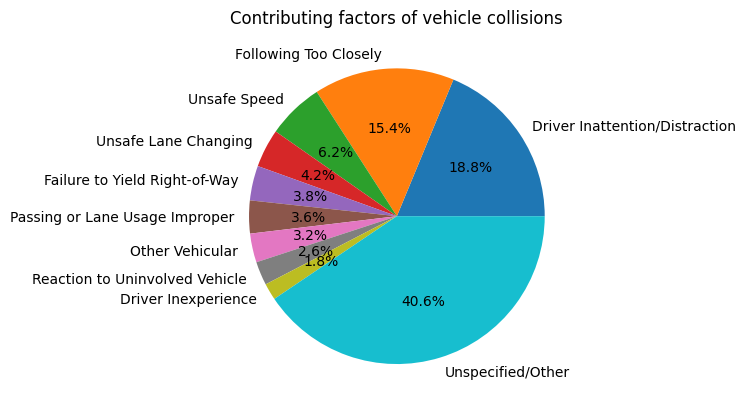

# Recommendations for regulatory and physical traffic improvements in New York City

## Milo Lani-Caputo

## [Tableau dashboard](https://public.tableau.com/app/profile/milo.lani.caputo/viz/nyc-collisions/Dashboard1?publish=yes)

### Background
New York City has seen 60,514 traffic collisions so far in the year 2024. Over 43% of these collisions resulted in injury or death. The City should focus its traffic remediation efforts on the locations in which the most injuries and fatalities are occurring. Using the NYC OpenData Motor Vehicle Collisions - Crashes dataset, 10 priority streets have been identified, all of which have seen 203 or more traffic collision injuries/fatalities so far this year.

### Problematic locations
The 10 NYC streets with the highest number of traffic fatalities in 2024 are shown below in the graph. It should be noted that 6 out of the 10 streets with the highest hazardous crash rates are expressways/parkways. Amelioration of conditions leading to high accident rates might look different on parkways than on an urban avenue like Atlantic Ave.

It is recommended that the City focus its efforts of regulatory and physical traffic improvements in these streets. Half of these locations have a collision injury/fatality count higher than the median for 2024, which is 255 injury/fatalities.

### Dangerous driving times

Additionally, injurious/fatal collisions on these streets occur most frequently between the hours of 2 pm and 1 am. There is also a significant spike in hazardous crashes between 8-9 am. Traffic remediation efforts should be focused on time intervals when there is consistently high collision frequency: 8-9 am and 8pm-1am. As shown in the graph below, fewer traffic fatalities happen in the early hours of the morning (1-5 am).

This data should be compared to general activity data for the city. It is possible that this trend reflects a general tendency for the city to be more busy, congested, and chaotic during the afternoon and evening. This could certainly account for the drop in traffic fatalities between 1 and 5 am, despite general visibility being decreased.

### Contributing factors to collisions

The most common contributing factors to collisions are denoted in the pie chart below. It should be noted that a significant portion of crashes do not list a contributing factor, and these crashes have been combined with all other contributing factors not specifically listed.

Driver Inattention/Distraction is the most common individual contributing factor to vehicle collisions, followed by Following Too Closely and Unsafe Speed. It is recommended that the city address these specific contributing factors to crashes on the most dangerous roadways in New York.

### Methodology
The public NYC OpenData Motor Vehicle Collisions - Crashes dataset is the basis of this report.

To determine the most problematic streets, a lump sum of the traffic fatalities was calculated for each ZIP code in the city. Traffic collisions which resulted in no injuries or fatalities were excluded from consideration. The city should focus its effort on reducing more serious accidents.

### Further investigation
There are many avenues for future investigation. More specific location data should be obtained to enable the City to target the most problematic sections of streets with infrastructure and traffic pattern changes. Additionally, trends in traffic fatalities that also include injuries should also be examined. For example, a traffic accident that kills two people and injures none might not be considered more severe than an accident that kills one person and injures five.

The type of vehicles involved in collisions should be considered as well. Are there large numbers of accidents involving bicycles that could be remedied by changes in bike infrastructure? Are there certain crosswalks that repeatedly involve pedestrian collisions? Finally, the year-to-year data involving collisions should be examined. Are there long-term trends indicating that the nature of vehicle collisions is changing? Were drivers less accustomed to large crowds during the ending stages of the COVID pandemic? Does the recent proliferation of e-scooters and e-bikes lead to more small-vehicle collisions? Yearly reviews of the location, frequency, and vehicle type of traffic accidents will allow the City to evaluate the efficacy of any strategy it applies to this problem. Particularly with respect to street-specific traffic pattern changes, this dataset remains a useful avenue to evaluate the effectiveness of the City’s measures to protect its residents.
