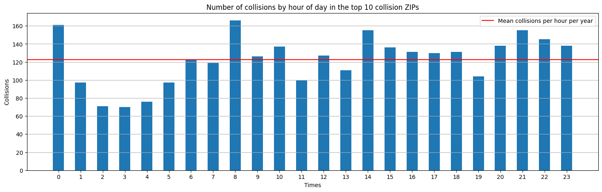

# Recommendations for regulatory and physical traffic improvements in New York City

## Milo Lani-Caputo

### Background
New York City has seen 60,514 traffic collisions so far in the year 2024. While over 99% of these collisions are non-fatal, 168 accidents involved the death of one or more person. The City should focus its traffic remediation efforts on the locations in which the most traffic fatalities are occurring. Using the NYC OpenData Motor Vehicle Collisions - Crashes dataset, 10 priority ZIP codes have been identified, all of which have seen 60 or more traffic collision fatalities so far this year.

### Problematic locations
The 10 NYC zip codes with the highest number of traffic fatalities in 2024 are shown below in
the graph.

It is recommended that the City focus its efforts of regulatory and physical traffic improvements in these zip codes. Half of these locations have a traffic fatality count higher than the median for 2024, which is 17 fatalities.

Additionally, fatal collisions in these ZIP codes occur most frequently between the hours of 2 pm and 8 pm. Traffic remediation efforts should be focused on this six-hour window. As shown in the graph below, fewer traffic fatalities happen in the early hours of the morning.

This data should be compared to general activity data for the city. It is possible that this trend reflects a general tendency for the city to be more busy, congested, and chaotic during the afternoon and evening. This could certainly account for the drop in traffic fatalities between 1 and 5 am, despite general visibility being decreased.

### Methodology
The public NYC OpenData Motor Vehicle Collisions - Crashes dataset is the basis of this report. All rows in the dataset which contain N/A (missing) data points were excluded from
analysis.

To determine the most problematic ZIP codes, a lump sum of the traffic fatalities was calculated for each ZIP code in the city. Traffic collisions which resulted in injuries were
excluded from consideration, since the vast majority of injury-causing incidents caused 3 or fewer injuries. The median was used to benchmark the data rather than the mean, since a relatively small number of ZIP codes made up for the lion’s share of fatal collisions.

### Further investigation
There are many avenues for future investigation. More specific location data should be obtained on the street-level to enable the City to target the most problematic streets with infrastructure and traffic pattern changes. Additionally, trends in traffic fatalities that also include injuries should also be examined. For example, a traffic accident that kills two people and injures none might not be considered more severe than an accident that kills one person and injures five.

The type of vehicles involved in collisions should be considered as well. Are there large numbers of accidents involving bicycles that could be remedied by changes in bike
infrastructure? Are there certain crosswalks that repeatedly involve pedestrian collisions? Finally, the year-to-year data involving collisions should be examined. Are there long-term
trends indicating that the nature of vehicle collisions is changing? Were drivers less accustomed to large crowds during the ending stages of the COVID pandemic? Does the recent proliferation of e-scooters and e-bikes lead to more small-vehicle collisions? Yearly reviews of the location, frequency, and vehicle type of traffic accidents will allow the City to evaluate the efficacy of any strategy it applies to this problem. Particularly with respect to street-specific traffic pattern changes, this dataset remains a useful avenue to evaluate the effectiveness of the City’s measures to protect its residents.